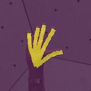

# NSRMhand
Official implementation of WACV 2020 paper [Nonparametric Structure Regularization Machine for 2D Hand Pose Estimation](https://arxiv.org/pdf/2001.08869.pdf) with Pytorch

## Abstract
Hand pose estimation is more challenging than body pose estimation due to severe articulation, self-occlusion and high dexterity of the hand. Current approaches often rely on a popular body pose algorithm, such as the Convolutional Pose Machine (CPM), to learn 2D keypoint features. These algorithms cannot adequately address the unique challenges of hand pose estimation, because they are trained solely based on keypoint positions without seeking to explicitly model structural relationship between them. We propose a novel Nonparametric Structure Regularization Machine (NSRM) for 2D hand pose estimation, adopting a cascade multi-task architecture to learn hand structure and keypoint representations jointly. The structure learning is guided by synthetic hand mask representations, which are directly computed from keypoint positions, and is further strengthened by a novel probabilistic representation of hand limbs and an anatomically inspired composition strategy of mask synthesis. We conduct extensive studies on two public datasets - OneHand 10k and CMU Panoptic Hand. Experimental results demonstrate that explicitly enforcing structure learning consistently improves pose estimation accuracy of CPM baseline models, by 1.17% on the first dataset and 4.01% on the second one.

Visualization of our proposed LDM-G1, LPM-G1, and our network structure.    
 

## Highlights
- We propose a novel cascade structure regularization methodology for 2D hand pose estimation, 
which utilizes synthetic hand masks to guide keypoints structure learning.
- We propose a novel probabilistic representation of hand limbs and an anatomically inspired composition strategy for hand mask synthesis.

## Running
#### Prepare  
 ~~~ 
pytorch >= 1.0  
torchvision >= 0.2 
numpy  
matplotlib 
~~~

#### Inference
1. Download our trained model (LPM G1&6) by running `sh weights/download.sh` or you can download it directly from this [Dropbox](https://www.dropbox.com/s/b83ongnpggeoebd/best_model.pth?dl=0) link

2. For pose estimation on the demo hand image, run
~~~
python inference.py
~~~
We provide example images in `images` folder. If set up correctly, the output should look like

 

**Note**: this model is only trained on Panoptic hand dataset, thus it may not work very well on other scene.

#### Training

1. Please download the Panoptic Hand dataset from their official [website](http://domedb.perception.cs.cmu.edu/handdb.html),
 and crop it based on 2.2x ground truth bounding box. 
 For your convenience, you can download our preprocessed dataset from [here](https://www.dropbox.com/s/ob0pbssocwszh9v/CMUhand.tar?dl=0).
 Please DO NOT duplicate it for any commercial purposes, and the copyright still belongs to [Panoptic](http://domedb.perception.cs.cmu.edu/handdb.html). 
If you want to train your own dataset, please also format it based on this `data_sample/` folder. 

2. Specify your configuration in configs/xxx.json.  
You can also use the default parameter settings, but remember to change the **data root**.  

3. Train model by 
~~~
python main.py + xxx.json
~~~

For example, if you want to train LPM G1, you should run 
~~~
python main.py LPM_G1.json
~~~

## Notation
- The most creativie part of our model is the structure representation, which is generated from keypoints only.  
you can see `dataset/hand_ldm.py` and `dataset/hand_lpm.py` for detail and adapt it for other tasks.

- Since this is a multi task learning problem, 
the weight ande decay ratio of keypoint confidence map loss and NSRM loss may vary for different dataset, 
you may need to adjust these parameters for your own dataset. 

- In our experiments and code, we only apply our NSRM to CPM, but we believe it will also work for other pose estimation network, 
such as Stacked Hourglass, HR-Net.  

## Citation
If you find this project useful for your research, please use the following BibTeX entry. Thank you!   

	@inproceedings{chen2020nonparametric,                    
	  title={Nonparametric Structure Regularization Machine for 2D Hand Pose Estimation},                 
	  author={Chen, Yifei and Ma, Haoyu and Kong, Deying and Yan, Xiangyi and Wu, Jianbao and Fan, Wei and Xie, Xiaohui},             
	  booktitle={The IEEE Winter Conference on Applications of Computer Vision},                     
	  pages={381--390},                  
	  year={2020}              
	}            

